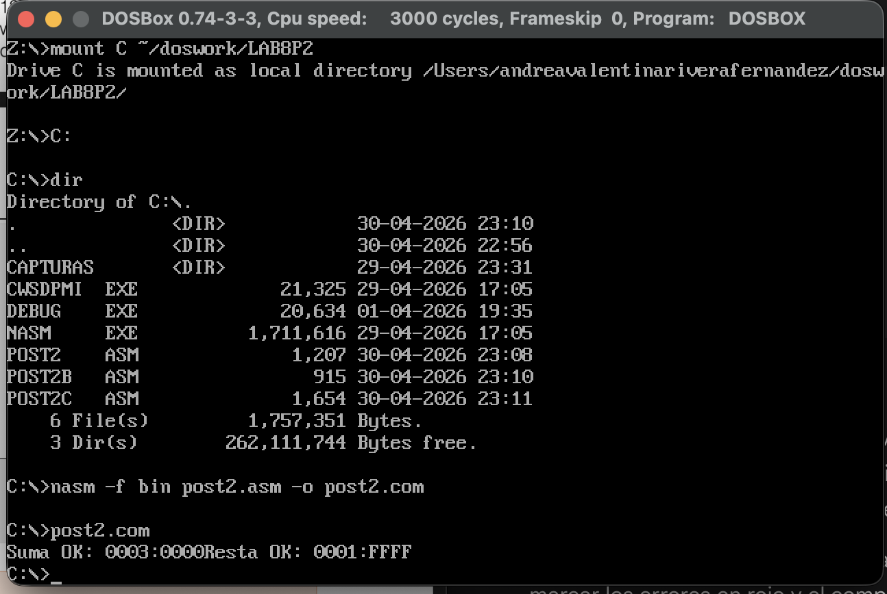
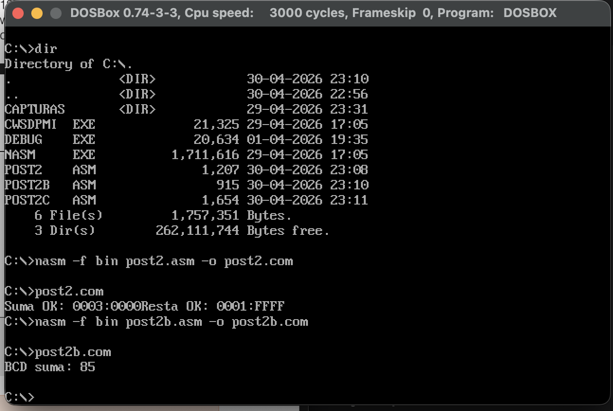
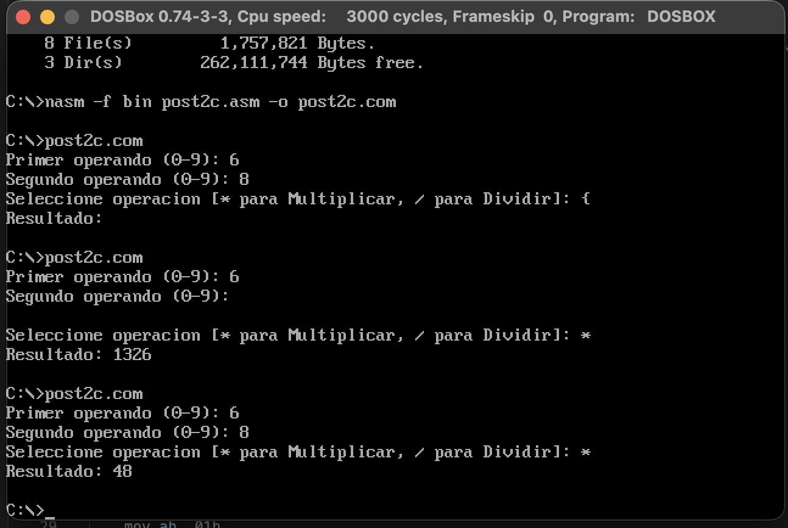

# Laboratorio: Operaciones Aritméticas y de Cadena (Unidad 8)

## Información del Estudiante
* **Nombre:** Andrea Valentina Rivera Fernández
* **Código:** 1152444
* **Institución:** Universidad Francisco de Paula Santander (UFPS)
* **Carrera:** Ingeniería de Sistemas
* **Materia:** Arquitectura de Computadores
* **Unidad:** 8 - Post-Contenido 2
* **Año:** 2026
  
## Objetivos
* Implementar aritmética de precisión múltiple de 32 bits utilizando las instrucciones `ADC` y `SBB`.
* Realizar operaciones en formato BCD empaquetado utilizando los ajustes decimales `DAA` y `DAS`.
* Desarrollar una calculadora funcional de un dígito para operaciones de multiplicación (`MUL`) y división (`DIV`) con conversión ASCII/binaria.

---

## Checkpoint 1: Aritmética de 32 bits (`post2.asm`)
Se validó el uso de acarreos y préstamos para operar con números que superan el tamaño de los registros de 16 bits.

*(Referencia: captura de pantalla mostrando "Suma OK: 0003:0000" y "Resta OK: 0001:FFFF")*

* **Suma:** Se utilizó `ADC` para propagar el acarreo de las partes bajas a las partes altas.
* **Resta:** Se utilizó `SBB` para gestionar el bit de préstamo (borrow) entre los registros.

---

## Checkpoint 2: Ajuste BCD Empaquetado (`post2b.asm`)
Se implementó la suma de valores en formato BCD (47h + 38h), aplicando la instrucción `DAA` para corregir el resultado binario a un formato decimal válido de dos dígitos por byte.

*(Referencia: captura de pantalla mostrando "BCD suma: 85")*

* **Resultado:** Sin el ajuste `DAA`, el procesador entregaría un valor hexadecimal inválido para el sistema decimal; la instrucción corrige los nibbles basándose en los flags `AF` y `CF`.

---

## Checkpoint 3: Mini Calculadora (`post2c.asm`)
Se construyó una interfaz básica para realizar operaciones aritméticas capturando operandos desde el teclado y mostrando el resultado convertido a decimal.

*(Referencia: captura de pantalla mostrando 6 * 8 = 48)*

* **Conversión:** Se aplicó la resta de 30h a la entrada ASCII para obtener el valor binario y una subrutina de división sucesiva por 10 para mostrar el resultado final.
* **Operaciones:** El programa permite seleccionar entre multiplicación y división, incluyendo una validación para la división por cero.

---

## Conclusiones
1. El uso de `ADC` y `SBB` es fundamental en la arquitectura de 16 bits para procesar datos de mayor tamaño sin pérdida de precisión.
2. Las instrucciones `DAA` y `DAS` facilitan el trabajo con interfaces orientadas al usuario (decimal) sin necesidad de algoritmos de conversión complejos para cada operación simple.
3. La correcta manipulación de la pila (`PUSH`/`POP`) durante la conversión de binario a ASCII permite visualizar resultados de múltiples dígitos en pantalla de forma ordenada.

---

### Entregables
* **Repositorio:** `apellido-post2-u8`
* **Archivos:** `post2.asm`, `post2b.asm`, `post2c.asm`
* **Herramientas:** NASM y DOSBox
